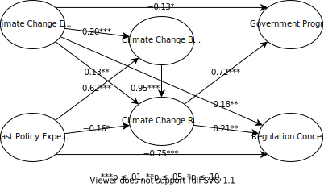

```{r setup, include=FALSE}
knitr::opts_chunk$set(echo = FALSE)
library(distill)
library(knitr)
library(kableExtra)
options(knitr.table.format = "html")
```

This is an application of the SEM2Agent scheme for an ABM based on the SEM in:

Niles, M. T., Lubell, M., & Haden, V. R. (2013). Perceptions and responses to climate policy risks among california farmers. Global Environmental Change, 23(6), 1752–1760. https://doi.org/10.1016/j.gloenvcha.2013.08.005


# Overview
## Purpose and patterns
The main purpose of this model is to demonstrate the SEM2Agent translation scheme.
The secondary purpose is to examine the participation of farmers in a new climate policy program dependent on their experience with such programs, their experience of climate change and normative pressure.
A possible pattern to evaluate this against would be empirical data on farmer‘s participation in such programs.


## Entities, state variables and scales
The model includes four entities.
Firstly, the space which the agents occupy and which determines which agents are neighbors.
Secondly, the water availability in Yolo county.
Thirdly, a government climate program whose properties are stored in the model object.
And lastly, agents which represent farmers.

The following table shows all entities with their state variables.

```{r}
# You can prepare the table as a csv and upload it here.
read.csv2("tables/ess_yolo-farming.csv") %>%
  as.data.frame() %>%
  kbl(col.names = c(
            "Entity",
            "State variable",
            "Represents",
            "Dynamic / static",
            "Type",
            "Range / value"
          ))  %>% 
  kable_styling()
```						

Representation of time:
Each model tic represents a year.
The model can run for up to 21 years.
Representation of space:
Space is represented in a simplified way.
The agents are placed on a grid so that each agent has four neighbors.
The agents do not move on the grid.
						

## Process overview and scheduling

In each model step, all agents are activated in random order.

1. An agent is activated.
2. They check for the current change in water availability (wachange) and update their climate change experience (ccexperience).
3. They check whether they currently participate in the new program (participation) and update their participation counter (ppcounter).
4. They compute their policy experience (ppexperience).
5. They computer their climate change belief (ccbelief).
6. They compute their perceived climate change risk (ccrisk).
7. They check which fraction of their neighbors participate in the new program.
8. They compute their government program participation intention (ppintention) and update their intention counter (ppintcounter).
9. If their participation intention counter passes a threshold that does not match their current participation status, they start or discontinue participation in the program. 

# Design concepts

## Basic principles
The model is based on the climate policy risk SEM by Niles et al. (2013) and simulates the success of a new climate incentive program based on the decision model presented in the SEM.
It also incorporates other findings presented in the paper, specifically that the view of past policies tends to become more positive over time.
In addition, the model includes a social normative component.
When deciding on whether to participate in the program, agents factor in the behavior of their neighbors.
The model assumes bounded rationality, as well as a tendency to underestimate climate change and a reluctance to participate in climate action programs.

## Emergence
The key emergent output is the amount of farmers that participates in the climate change policy.
Imposed are the initial values for all model variables, the factors in the equations for the different endogenous variables, as well as the availability of water and the characteristics of the model policy.

## Individual decision making
Agents explicitly decide only about their current participation which depends on all other variables.
All other variables represent the farmer‘s objective to lead a successful farming business while balancing the risks posed by climate crisis with the additional demands of adaptive policies.
If those variables are changed to a sufficient extent, the agent‘s participation behavior will also change.
Social norms and spatial aspects are integrated with the agent including their neighbor's behavior in decision process.
Cultural values are not explicitly part of the decision process.
Temporal aspects play a role insofar as certain values will only react to exogenous inputs once a certain time has passed.
Uncertainty is included using stochasticity at model initiation.

## Adaptation
For each model step, the agent‘s state variables are adapted directly and indirectly dependent on the policy characteristics, their neighbors behavior and the water availability.
The behavior is modeled via indirect objective-seeking.

## Objectives
The adaptive behavior does not use direct objective-seeking.

## Learning
Learning is not included.

## Prediction
Prediction is not explicitly included.
Implicitly, the agents predict that changing their behavior will bring closer to their implicit objective of leading a successful farm.


## Sensing
Agents are assumed to exactly sense all external and internal variables.
However, that variables input on their state variables is modulated by path coefficients and perceptive heuristics.

## Interaction
Agents directly interact with their four immediate neighbors.
They check whether their neighbors participate in the policy or not.
This is a simplified representation of injunctive normative pressure.

## Heterogeneity
Agents are homogenous in their decision making.

## Stochasticity
Stochasticity is included to generate variability in the initial value of the agent‘s state variables.
The values are sampled based on the descriptive statistics presented in the SEM paper.
This is done in order to represent the real world diversity in opinions and values.

## Collectives
There are no collectives in the model.

## Observation
At the end of each model step, the value for all agent state variables is tracked.

# Details
## Implementation details
The model is implemented in Julia using the Agents.jl package.
It is accessible (on GitHub).

## Initialization
Upon initialization, the following entities are created:

- The water availability, sourced from empirical data.
- The farmer agents with all values for all state variables sampled from descriptive statistics based on the descriptive statistics reported in the paper. This variability is supposes to represent variability in opinions in real-life farmers.
- The model program, with values for its „objective“ quality, the fraction of initial participants, and the fraction of neighbors needed to create participation pressure in agents. These values are varied in different simulation experiments to evaluate the success rates for different program characteristics and assumptions about social pressure.

## Input Data
### Overview

- The data for the agent‘s state variables and parameters comes from the paper by Niles et al. (2013). The level of available data is variable range, as well rough descriptives for the survey answers, and model data. So does exemplary data for the new programs characteristics.
- The data for the availability of water comes from https://www.drought.gov/states/california/county/yolo. The data contains information on the amount of the county experiencing different levels of drought, reported each week.

### Structure
In the paper, there are three main types of data:
Descriptive survey data for all variables in the model (Climate Change Experience, Climate Change Belief, Climate Change Risk, Government Program Participation, Regulation Concern, Past Policy Experience), path coefficients for the relationships between the variables and the variance explained for all variables except Government Program Participation and Regulation Concern.

<center>



</center>

```{r}
# You can prepare the table as a csv and upload it here.
read.csv2("tables/ids_sem_yolo-farming.csv") %>%
  as.data.frame() %>% 
  lapply(function(x) {gsub("\\*", "\\\\*", x)}) %>%
  as.data.frame() %>% 
  kbl(col.names = c(
            "Variable",
            "Range",
            "Descriptive statistics",
            "SEM regression equation",
            "SEM R^2"
          ))  %>% 
  kable_styling()
```				

The drought data gives the percentage of the county which has reached a certain drought level.
It ranges from 0 (not dry) over D0 (abnormally dry) to D4 (exceptional drought).

### Mapping
All SEM variables except Regulation Concern are selected as state variables characterizing the agent‘s decision process on whether to participate in the new program or not.
The agents are initialized with a value which is randomly sampled based on the descriptive statistics.
The structural equations with the associated path coefficients are used for each agent to compute the new values for the variables in each time step.
The variance explained is used as a cap for the maximum change a variable can go through in each model step.
The initial values are normalized so all scales reach from -1 to 1.
Similarly, path coefficients are normalized so their sum is 1.

```{r}
# You can prepare the table as a csv and upload it here.
read.csv2("tables/idm_sem_yolo-farming.csv") %>%
  as.data.frame() %>% 
  lapply(function(x) {gsub("\\*", "\\\\*", x)}) %>%
  as.data.frame() %>% 
  kbl(col.names = c(
            "Source variable",
            "ABM state variable",
            "Range",
            "Initialization",
            "Updating"
          ))  %>% 
  kable_styling()
```	

For the water availability data, we invert the mean of all drought fractions.
Therefore, a value of 1 corresponds to no exceptional dryness and is equated with full water availability.
A value of 0 corresponds to maximum dryness in the whole county and is equated with no water availability.
	
### Patterns
The regression equations from the SEM are used to calculate the model variables in each step.


## Submodels
There are no submodels.